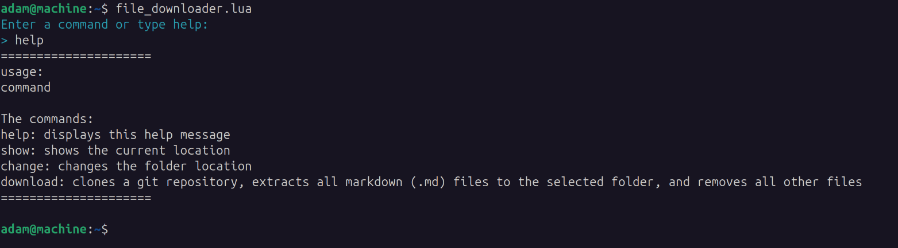

# Obsidian File Downloader

A simple Lua script to download markdown files for Obsidian.

## Installation Video

Watch the installation video:

[](https://raw.githubusercontent.com/Adam-Elmi/Obsidian-File-Downloader/master/assets/Installation.webm)


## Installation

> **Note:**  
> Before you start, make sure you have the Lua interpreter installed on your computer.  
> You can download it from [https://www.lua.org/download.html](https://www.lua.org/download.html).

1. **Clone the Repository:**
```bash
git clone https://github.com/Adam-Elmi/Obsidian-File-Downloader.git

cd Obsidian-File-Downloader
```

2. **Make the Script Executable:**
```bash
chmod +x file_downloader.lua
```

3. **Add the Folder to Your PATH:**
You can use any text editor to edit your shell configuration file:

- Bash:
```bash
nano ~/.bashrc
```

- Zsh:
```bash
nano ~/.zshrc
```

Add the following line at the end of your shell configuration file, replacing `/path/to` with the actual path where you cloned "Obsidian-File-Downloader":
```bash
export PATH="$HOME/path/to/Obsidian-File-Downloader:$PATH"
```
For example, if you cloned it to `/home/yourusername/Tools`, the line would be:
```bash
export PATH="$HOME/Tools/Obsidian-File-Downloader:$PATH"
```

Reload the shell configuration:

- For Bash:
```bash
source ~/.bashrc
```

- For Zsh:
```bash
source ~/.zshrc
```

## Usage

You can run the script directly with Lua:
```bash
lua file_downloader.lua
```

Or, if you added it to your PATH and made it executable:
```bash
file_downloader.lua
```


### Commands

Run the script and enter a command when prompted:

- **Command-Line:**


- **help:**


- **show:**


- **change:**


- **download:**


- **Output:**


## License
MIT License